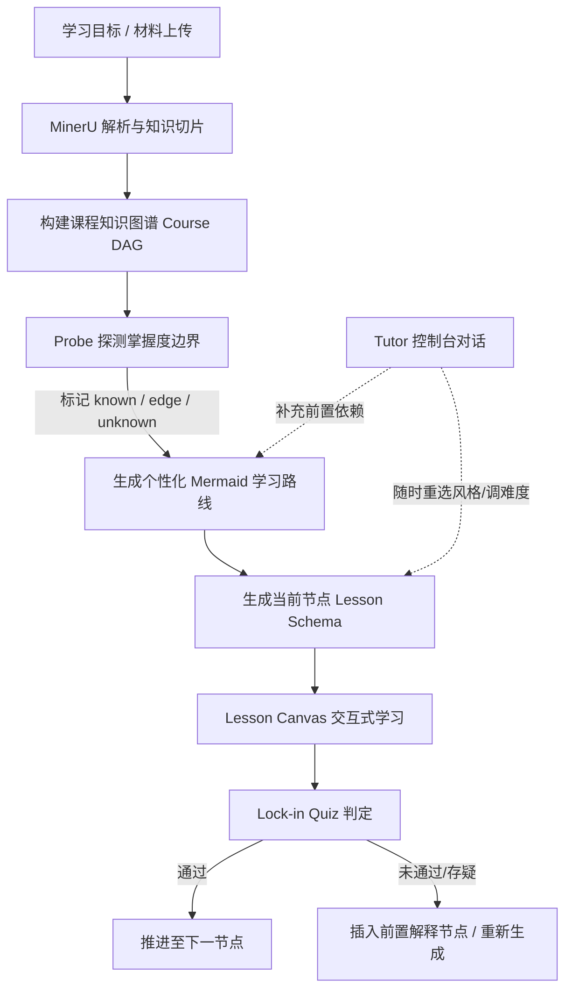

# OpenTutor 架构设计规范

## 1. 系统定位与核心愿景

**OpenTutor** 是一个 **AI 原生自适应交互式学习系统**。
它融合了：
1. **Alvar 认知教学法**（Probe 探测 → DAG 规划 → 单步推理教学 → Lock-in 即时锁定）。
2. **多模态知识萃取引擎**（基于 MinerU SDK 解析教材/PPT/试卷，抽取知识点与题库）。
3. **结构化交互画布（Lesson Canvas）**（基于 Lesson Schema JSON 协议，解耦内容生成与前端渲染）。
4. **自适应学习控制台**（对话框作为教学控制层，支持动态调整难度、切换呈现形式与重编排 DAG）。

---

## 2. 整体架构分层

```
+-------------------------------------------------------------------------+
|                              客户端层 (UI)                               |
|   +---------------------------------+  +----------------------------+   |
|   |    Lesson Canvas (交互学习画布)   |  |   AI Tutor (学习控制面板)   |   |
|   |  - Text / Formula (KaTeX)       |  |  - 难度/风格动态干预        |   |
|   |  - SVG Diagram / Animation      |  |  - 实时提问与追问          |   |
|   |  - Code Runner / Simulation     |  |  - 节点前插/重编排          |   |
|   |  - Interactive Quiz / Questions |  |                            |   |
|   +---------------------------------+  +----------------------------+   |
|              ↑ (JSON Schema 驱动)                   | (控制指令)        |
+--------------|--------------------------------------|-------------------+
|              |          通信与容器适配层            ↓                   |
|   Web (Next.js / React)  <--->  HarmonyOS ArkWeb Bridge / Native        |
+-------------------------------------------------------------------------+
|                             服务端核心层                                 |
|   +-----------------------------------------------------------------+   |
|   |                   Alvar 教学编排引擎 (Tutor Core)                |   |
|   |  - Probe Service: 掌握度边界二分探测 (known/edge/unknown)       |   |
|   |  - Planner Service: Mermaid DAG 教学路径规划                     |   |
|   |  - Generator: 结构化 Lesson Schema JSON 生成                    |   |
|   |  - Verifier: 教学事实与定理核验 (learn-verify)                   |   |
|   +-----------------------------------------------------------------+   |
|   |                   多模态知识萃取 (Knowledge Extraction)          |   |
|   |  - MinerU SDK: PDF / PPT / 试卷高精度解析                       |   |
|   |  - Question Extractor & Knowledge Tagger                        |   |
|   |  - Wiki & Review Guide Generator                                |   |
|   +-----------------------------------------------------------------+   |
|   |                   检索与存储基础设施 (Storage & RAG)            |   |
|   |  - Vector DB (Chroma) + Google / Local Embeddings               |   |
|   |  - Metadata DB: SQLite (Courses, Nodes, Questions, Progress)    |   |
|   |  - Learner Profile: 认知基线与学习习惯持久化                    |   |
+-------------------------------------------------------------------------+
```

---

## 3. 核心协议规范：Lesson Schema

前端不直接由大模型生成不可控的 HTML，而是通过严格的 JSON Schema 渲染。

```typescript
export interface LessonSchema {
  id: string;                      // 课时唯一标识
  nodeId: string;                  // 所属知识图谱节点 ID
  title: string;                   // 关卡标题
  objective: string;               // 本节单步推理目标
  prerequisites: string[];         // 前置依赖知识点
  blocks: LessonBlock[];           // 教学内容块序列
  assessment: AssessmentConfig;    // Lock-in 锁定测试
}

export type LessonBlock =
  | TextBlock
  | FormulaBlock
  | DiagramBlock
  | CodeBlock
  | SimulationBlock
  | QuizBlock;

export interface TextBlock {
  type: 'text';
  content: string;                 // Markdown 文本
}

export interface FormulaBlock {
  type: 'formula';
  latex: string;                   // LaTeX 公式
  explanation?: string;
}

export interface DiagramBlock {
  type: 'diagram';
  format: 'svg' | 'mermaid';
  data: string;                    // SVG 源码或 Mermaid 语法
  claim: string;                   // 该图表达的核心事实
}

export interface CodeBlock {
  type: 'code';
  language: string;
  code: string;
  runnable?: boolean;
}

export interface SimulationBlock {
  type: 'simulation';
  component: string;               // 前端预置组件名，如 'attention-weights'
  initialState: Record<string, any>;
}

export interface QuizBlock {
  type: 'quiz';
  quizType: 'multiple_choice' | 'connector' | 'categorizer' | 'segmenter';
  prompt: string;
  options?: { id: string; text: string }[];
  correctAnswer: string | string[];
  explanation: string;
}

export interface AssessmentConfig {
  lockInQuiz: QuizBlock;           // 离开本步必须锁定的验证题
  passThreshold: number;
}
```

---

## 4. Alvar 认知学习闭环



1. **Phase 1 - Probe（探测）**：二分探测学习者认知边界，区分 `known`（已掌握）、`edge`（临界模糊）、`unknown`（未知）、`blocked`（前置阻断）。
2. **Phase 2 - Plan（规划）**：以 Mermaid DAG 可视化展示单步推理路径，确认起点（从 `known` 出发，穿过 `edge`）。
3. **Phase 3 - Teach（单步教学）**：一次仅推进一个节点，生成富交互 Lesson Schema，配以精准 SVG/Mermaid 图解（learn-visual）与事实核验（learn-verify）。
4. **Phase 4 - Lock-in（锁定）**：每个节点必须通过交互验证题方可推进，绝不进行无反馈长篇灌输。

---

## 5. 跨平台支持路径

- **阶段 1（Web 优先）**：Next.js / React 18 + Tailwind CSS + Framer Motion 构建旗舰级交互画布。
- **阶段 2（ArkWeb 混合）**：将 Web 学习画布作为核心 UI 嵌入鸿蒙应用，鸿蒙原生 ArkTS 处理通知、本地存储、权限与网络桥接。
- **阶段 3（ArkUI 原生）**：由于底层完全依赖 `Lesson Schema JSON`，可直接编写 ArkUI 原生 Block Renderer，后端逻辑零改动。
