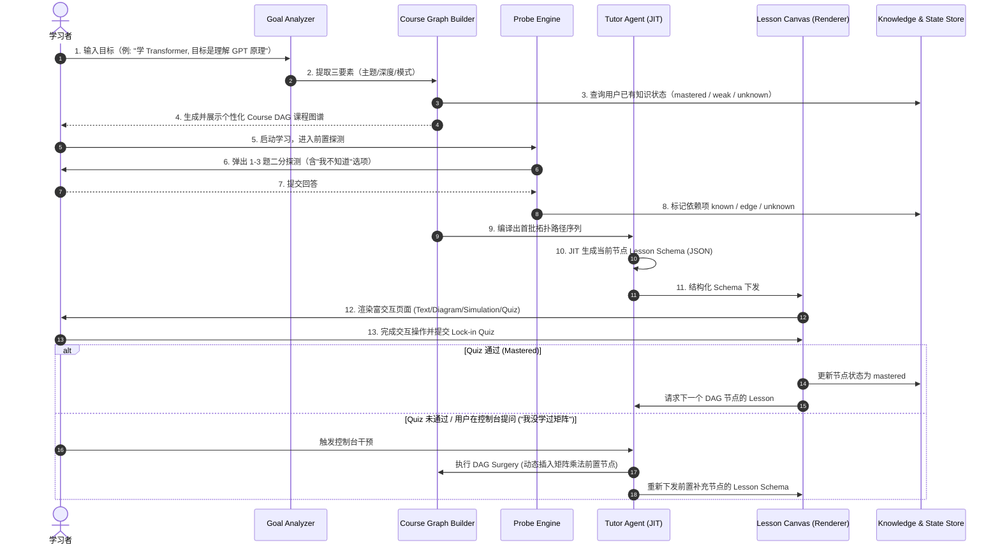

# OpenTutor 产品需求文档 (PRD)

> **版本**：v1.0.0-MVP  
> **状态**：正式归档  
> **技术路线**：TypeScript / React 18 / Next.js / Pi-Agent / HarmonyOS ArkWeb 混合容器

---

## 0. 产品概述与设计哲学

### 0.1 产品定位：AI Native Learning Space
**OpenTutor** 是一个由 AI 驱动的自适应交互式学习空间（AI-Native Learning Space）。
它彻底重构了传统在线教育的静态链条（`课程列表 → 固定章节列表 → 刷视频/看文本/做题`），将学习过程重塑为：
- **课程是学习目标空间**：课程不再是内容的死板容器，而是用户想要达成的具体能力空间；
- **知识图谱是底层依赖网**：由 DAG（有向无环图）管理知识点的前后依赖与认知状态；
- **AI Tutor 是交互控制层**：对话框不是主要的信息展示区，而是随时调整教学节奏、难度与路径的**控制面板（Control Panel）**；
- **Lesson Canvas 是交互核心**：基于结构化 **Lesson Schema (JSON)** 驱动前端组件注册表渲染富媒体交互页面。

### 0.2 对标与范式转移
| 维度 | 传统在线教育 / 刷题产品 | 普通 ChatGPT 对话学习 | OpenTutor (AI-Native Learning Space) |
| :--- | :--- | :--- | :--- |
| **内容组织** | 预录制视频、固定大纲 | 扁平的纯文本流水账 | **目标驱动的 JIT（即时）动态编译课程图谱** |
| **交互形式** | 单向阅读、机械单选题 | 纯 Markdown 对话框 | **Lesson Canvas 多模态交互画布（公式/SVG/代码/模拟器/连线分类）** |
| **个性化机制**| 无（所有人看同一套大纲） | 仅在单轮对话中调整语气 | **二分探测认知边界，按需动态插拔 DAG 节点（DAG Surgery）** |
| **认知闭环** | 课程学完才期末考试 | 无强制验证，产生“懂了”的错觉 | **单步推理教学 + Lock-in 测验强制锁定** |
| **跨端架构** | 传统 H5 或繁重原生 App | Web 网页 | **Web UI 优先 + ArkWeb 混合容器嵌入 + 演进 ArkUI 原生渲染** |

---

## 1. 整体信息架构与核心用户旅程

### 1.1 顶层信息架构 (IA)
```
                                首页 (Home)
                                     │
                     ┌───────────────┴───────────────┐
                     ▼                               ▼
            我的学习空间 (Spaces)             新建学习目标 (New Goal)
                     │
         ┌───────────┴───────────┐
         ▼                       ▼
   课程图谱 (Course Graph)    知识状态 (Knowledge Map)
         │
         ▼
 ┌───────────────────────────────────────────────────────────┐
 │                AI Learning Room (核心学习室)               │
 │                                                           │
 │  ┌───────────────────────────────┐  ┌──────────────────┐  │
 │  │                               │  │                  │  │
 │  │     Lesson Canvas (交互画布)   │  │  AI Tutor Panel  │  │
 │  │   - Text / Formula (KaTeX)    │  │  (教学控制面板)    │  │
 │  │   - SVG Diagram / Animation   │  │                  │  │
 │  │   - Simulation / Code         │  │  - 调难度/换风格  │  │
 │  │   - Lock-in Quiz 判定         │  │  - 知识缺口追问  │  │
 │  │                               │  │  - 动态重编排    │  │
 │  └───────────────────────────────┘  └──────────────────┘  │
 └───────────────────────────────────────────────────────────┘
```

### 1.2 用户全链路旅程 (End-to-End User Journey)


---

## 2. 详细功能模块规范

---

### 模块 1：学习目标分析与课程图谱生成模块 (Goal & Course Graph Module)

#### 1.1 模块定位
将用户模糊的自然语言学习诉求（或教材/试卷输入）编译为精准的教学 DAG。

#### 1.2 核心子服务
1. **Goal Analyzer（目标分析器）**：
   - 提取学习目标三要素：
     - `topic`：核心主题（如 `Transformer`、`CSAPP Virtual Memory`）。
     - `target`：预期达成的终态能力（如 `理解GPT核心架构`、`能手写Self-Attention`）。
     - `depth`：`basic`（概念直觉）| `intermediate`（工程实操/主流应用）| `advanced`（数学推导/底层机制）。
     - `mode`：`engineering`（代码优先）| `academic`（严谨推导）| `intuitive`（图解直觉）。
2. **Course Graph Builder（课程图谱编译器）**：
   - 构建结构化的依赖有向无环图（DAG）。
   - **两层图谱模型**：
     - **Level 1: Global Graph（全局图谱）**：跨课程共享的基础依赖（如 `数学基础 -> 线性代数 -> 矩阵乘法 -> Attention -> Transformer`）。
     - **Level 2: Course Graph（课程图谱）**：当前目标下的专用教学图谱。
   - 节点结构：包含 `id`、`title`、`objective`、`prerequisites`（前置节点ID列表）、`order`、`estimatedMinutes`。
3. **Learning Path Planner（学习路径规划器）**：
   - 读取用户知识状态（`User Knowledge Graph`），自动跳过用户已掌握（`mastered`）的节点；
   - 输出适合当前学习者节奏（如每日 30 分钟）的拓扑有序序列。

---

### 模块 2：Alvar 认知教学与探测引擎 (Alvar Tutoring Engine)

#### 2.1 模块定位
落地 **Alvar 认知教学法**，坚持“单人对单师”、“在理解边缘教学”、“单步推理推进”与“即时锁定”四大原则。

#### 2.2 核心子服务
1. **Probe（掌握度二分探测引擎）**：
   - 在进入新主题或关键依赖前，发起 1–3 题微测验。
   - **硬性规则**：
     - 每题必须包含明确的 **“我不知道（I don't know）”** 选项，严格防止蒙猜污染数据。
     - 支持思维回溯（Talk-through）：若答案正确但理由错误，判定为 `edge` 而非 `known`。
   - 探测状态迁移：
     - `known`：已掌握（正确且理由充分，跳过教学）；
     - `edge`：临界（答对但薄弱，或近距离答错，作为教学切入起点）；
     - `unknown`：未知（基础完全缺失，作为后续展开目标）；
     - `blocked`：阻断（用户明确表示不知道，需要先补齐前置依赖）。
2. **Step-by-Step Generator（单步推理生成器）**：
   - 杜绝传统 LLM 一次性喷吐万字长文的恶习；
   - 每次只生成单个知识节点所需的解释与推演步骤；
   - 联动 `learn-visual`：针对抽象概念自动生成高对比度、单一主张的 **SVG / Mermaid** 矢量图解；
   - 联动 `learn-verify`：核验定理、学术引用与事实，杜绝大模型幻觉。
3. **Lock-in Quiz 判定器**：
   - 每一个 Lesson 节点末尾必须包含闭环验证题（Lock-in Quiz）；
   - 验证通过方可解锁下一节点；验证不通过则停留在当前步、提供针对性拆解或动态插入前置知识点。

---

### 模块 3：Lesson Schema 协议与交互画布 (Lesson Schema & Canvas)

#### 3.1 模块定位
定义 AI 教学输出与前端渲染层之间的**标准协议**。AI 只负责输出严格的 JSON Schema，前端通过 Component Registry 解耦渲染。

#### 3.2 Block 组件协议体系
| Block 类型 | 字段定义 (`LessonBlock`) | 渲染器职责与交互表现 |
| :--- | :--- | :--- |
| **`TextBlock`** | `{ type: "text", content: string }` | Markdown 解析、概念分段、加粗高亮、友好排版。 |
| **`FormulaBlock`**| `{ type: "formula", latex: string, explanation?: string }` | KaTeX 高精度数学公式渲染，支持公式拆解注解。 |
| **`DiagramBlock`**| `{ type: "diagram", format: "svg" \| "mermaid", data: string, claim: string }` | 响应式 SVG 矢量图解或 Mermaid 动态关系图，附带核心结论说明。 |
| **`CodeBlock`** | `{ type: "code", language: string, content: string, runnable?: boolean }` | 语法高亮代码块、支持代码折叠与未来在线执行沙箱。 |
| **`SimulationBlock`**| `{ type: "simulation", component: string, state: Record<string, any> }` | 预置可交互小部件（如：动态拖拽 Token 观察 Attention 权重矩阵变化、滑块调节超参数）。 |
| **`QuizBlock`** | `{ type: "quiz", question: string, quizType: "mcq" \| "connector" \| "categorizer", options: any[], answer: any }` | 交互式概念测验：单选题、连线题、拖拽分类题，即时反馈对错与解析。 |

#### 3.3 前端 Component Registry 架构
```
+-------------------------------------------------------------------+
|                        LessonRenderer (分发器)                     |
|                                                                   |
|   switch (block.type) {                                           |
|     case "text":       return <TextRenderer block={block} />      |
|     case "formula":    return <FormulaRenderer block={block} />   |
|     case "diagram":    return <DiagramRenderer block={block} />   |
|     case "code":       return <CodeRenderer block={block} />      |
|     case "simulation": return <SimulationRegistry.get(...) />    |
|     case "quiz":       return <QuizRenderer block={block} />      |
|   }                                                               |
+-------------------------------------------------------------------+
```

---

### 模块 4：AI Tutor 教学控制台与动态干预 (Tutor Control Panel & DAG Surgery)

#### 4.1 模块定位
彻底改变聊天对话框的定位——**对话框不是主界面，而是教学控制层（Control Panel）**。

#### 4.2 三大动态干预能力
1. **教学表达形态动态切换（Format Morphing）**：
   - 用户输入：“*太抽象了，请用代码给我解释*”
   - Tutor 响应：动态将当前页面的 `DiagramBlock` 替换为 Python `CodeBlock` 并重新下发 Schema，Canvas 局部平滑更新。
2. **教学难度实时伸缩（Difficulty Scaling）**：
   - 用户输入：“*这个公式太难了，简单讲讲*”
   - Tutor 响应：`difficulty` 从 `advanced` 降级为 `basic`，移除复杂公式块，插入生活比喻 `TextBlock` 与直观图解 `DiagramBlock`。
3. **知识图谱动态插拔（DAG Surgery）**：
   - 用户输入：“*什么是 Token？*” 或在测验中暴露了未掌握的底层概念
   - Tutor 响应：
     1. 识别当前存在知识断层（Knowledge Gap: `Tokenization = unknown`）；
     2. 在当前 DAG 中动态挂起当前节点（`Attention` 挂起）；
     3. 插入前置补充节点：`[Tokenization] -> [Embedding]`；
     4. 完成前置节点学习后，自动恢复主线 `[Attention]`。

---

### 模块 5：学习状态机与画像存储 (Learner Profile & State Store)

#### 5.1 模块定位
负责学习者长期认知特征、课时进度以及全局/课程知识图谱状态的沉淀与持久化。

#### 5.2 状态数据模型
1. **Learner Profile（学习者画像）**：
   - `pace`：单步推进步调（默认一次一个推理步）；
   - `strugglePolicy`：困难应对策略（保留核心思考，系统吸收检索/编排等外围认知负载）；
   - `tone & density`：语言精炼度偏好；
   - `solidGround`：已牢固掌握的底层知识与符号体系。
2. **Lesson Progress（课时进度）**：
   - `lessonId`、`completedBlocks: string[]`、`wrongQuestions: string[]`、`feedback: string`。
3. **Knowledge Graph Node State（节点状态跃迁）**：
   ```
   [unknown] ──(探测/遇到)──► [edge] ──(教学/练习)──► [learning] ──(通过Lock-in)──► [mastered]
                                  │
                          (用户表示不清楚)
                                  ▼
                              [blocked] ──(插入前置)──► [edge]
   ```

---

### 模块 6：跨平台与鸿蒙 ArkWeb 混合容器架构 (ArkWeb & Cross-Platform)

#### 6.1 架构路线与技术分工
```
+-------------------------------------------------------------------+
|               HarmonyOS Native Application (ArkTS + ArkUI)        |
|                                                                   |
|   ┌───────────────────────────────────────────────────────────┐   |
|   │ 鸿蒙原生能力层 (ArkTS)                                     │   |
|   │  - Agent 状态与后台服务通知                                │   |
|   │  - 本地文件读写与 SQLite / rawfile 离线存储                │   |
|   │  - 系统权限与设备硬件互调                                  │   |
|   └─────────────────────────────┬─────────────────────────────┘   |
|                                 │                                 |
|             ArkWeb JS Bridge (registerJavaScriptProxy)            |
|                                 │                                 |
|   ┌─────────────────────────────┴─────────────────────────────┐   |
|   │ 复杂交互画布与控制层 (ArkWeb Component Container)          │   |
|   │  - React 18 / Next.js SPA 渲染引擎                         │   |
|   │  - Lesson Canvas 结构化组件体系 (Text/SVG/Formula/Quiz)     │   |
|   │  - AI Tutor 对话控制面板                                  │   |
|   └───────────────────────────────────────────────────────────┘   |
+-------------------------------------------------------------------+
```

#### 6.2 三阶段平滑演进策略
- **Phase 1（Web 原型与生产优先）**：Next.js 14 + React 18 + Tailwind CSS，验证完整业务闭环与 Schema 协议。
- **Phase 2（ArkWeb 混合容器集成）**：将 Web 产物部署到鸿蒙 App 的 `rawfile/web/` 中，通过 `Web({ src: $rawfile("web/index.html") })` 运行，通过 JSBridge 实现原生通信。
- **Phase 3（ArkUI 原生声明式 Renderer）**：由于数据层完全解耦为 `LessonSchema JSON`，后续可在鸿蒙端用 ArkUI 原生重写一套 `LessonRenderer`，后端 Agent 与数据体系零修改。

---

## 3. 核心数据契约 (TypeScript Schemas)

```typescript
// 1. 学习目标定义
export interface LearningGoal {
  topic: string;
  target: string;
  depth: 'basic' | 'intermediate' | 'advanced';
  mode: 'engineering' | 'academic' | 'intuitive';
  estimatedDays?: number;
}

// 2. 课程图谱与节点
export interface CourseGraph {
  courseId: string;
  topic: string;
  target: string;
  nodes: CourseNode[];
  edges: { from: string; to: string }[];
}

export interface CourseNode {
  id: string;
  title: string;
  objective: string;
  order: number;
  estimatedMinutes: number;
  prerequisites: string[];
  status: 'unknown' | 'blocked' | 'edge' | 'learning' | 'mastered';
}

// 3. 学习路径
export interface LearningPath {
  courseId: string;
  nodeIds: string[];
  currentNodeId: string;
  progressPercent: number;
}

// 4. Lesson Schema 协议全集
export interface LessonSchema {
  id: string;
  nodeId: string;
  title: string;
  objective: string;
  prerequisites: string[];
  blocks: LessonBlock[];
  assessment: AssessmentConfig;
  nextNodes: string[];
}

export type LessonBlock =
  | TextBlock
  | FormulaBlock
  | DiagramBlock
  | CodeBlock
  | SimulationBlock
  | QuizBlock;

export interface TextBlock {
  type: 'text';
  content: string;
}

export interface FormulaBlock {
  type: 'formula';
  latex: string;
  explanation?: string;
}

export interface DiagramBlock {
  type: 'diagram';
  format: 'svg' | 'mermaid';
  data: string;
  claim: string;
}

export interface CodeBlock {
  type: 'code';
  language: string;
  content: string;
  runnable?: boolean;
}

export interface SimulationBlock {
  type: 'simulation';
  component: string;
  state: Record<string, any>;
}

export interface QuizBlock {
  type: 'quiz';
  quizType: 'mcq' | 'connector' | 'categorizer';
  question: string;
  options: { id: string; text: string; isCorrect: boolean }[];
  explanation: string;
}

export interface AssessmentConfig {
  lockInQuiz: QuizBlock;
  passCriteria: string;
}

// 5. 课时进度与状态
export interface LessonProgress {
  lessonId: string;
  nodeId: string;
  completedBlocks: string[];
  wrongQuestions: string[];
  feedback?: string;
  isLocked: boolean;
}
```

---

## 4. MVP 研发范围与交付边界

### 4.1 MVP 包含范围 (Must-Have)
1. **学习目标解析**：支持自然语言输入目标并解析出三要素；
2. **课程图谱编译**：基于目标 JIT 编译出带前后依赖关系的 Course DAG；
3. **二分认知探测 (Probe)**：支持 1–3 题微测验并标记前置掌握度；
4. **单步 Lesson JIT 生成**：按节点生成标准 `LessonSchema (JSON)`；
5. **多模态交互画布**：支持 Text、Formula (KaTeX)、SVG/Mermaid Diagram、Code、基础 Quiz 的前端渲染；
6. **Lock-in 闭环验证**：单课答题通过才能解锁下一关；
7. **控制台动态干预**：支持在对话框输入“换代码演示/简单点/解释前置概念”，系统动态更新当前 Schema 或插入 DAG 补充节点；
8. **跨端构建兼容**：Web 前端标准构建成功，可置入 ArkWeb 容器运行。

### 4.2 MVP 明确砍掉/延后范围 (Out-of-Scope)
- ❌ **全局超大规模全学科知识图谱**（MVP 仅支持基于当前目标的课程级 DAG 生成）；
- ❌ **复杂 3D/物理级大型模拟器**（MVP 仅支持轻量 DOM/SVG 交互组件）；
- ❌ **多用户在线协同与社交分享**；
- ❌ **复杂离线多端双向同步算法**。

---

## 5. 可机械判定的系统验收标准 (Acceptance Criteria)

| 编号 | 验收项 | 可机械判定的验证标准 |
| :---: | :--- | :--- |
| **AC-1** | **目标编译与图谱生成** | 输入 `"我要学习 Transformer，理解 GPT 核心原理"`，系统在 5 秒内返回合法 `CourseGraph` JSON，节点数 $\ge 3$，且包含从 Attention 到 Transformer 的有向边。 |
| **AC-2** | **Alvar Probe 探测执行** | 启动课程时触发 Probe 接口，返回包含至少 1 道含 `I don't know` 选项的选择题；用户提交正确/错误答案后，图谱节点状态准确变更为 `known` 或 `edge/unknown`。 |
| **AC-3** | **Lesson Schema 协议合规** | 检查生成的 `LessonSchema` 数据，必须包含 `id`、`title`、`objective`、`blocks` 和 `assessment.lockInQuiz`，Schema 校验错误率为 0。 |
| **AC-4** | **Lesson Canvas 多模态渲染** | 给定包含 Markdown、KaTeX 公式（如 $\text{Softmax}(QK^T/\sqrt{d})V$）、SVG 图解和选项的 Schema，前端组件无报错挂载并呈现视觉元素。 |
| **AC-5** | **Lock-in 状态机推进** | 模拟答错 Lock-in 测验，当前关卡锁定（`isLocked: true`，不可推进）；模拟答对测验，节点状态变更为 `mastered`，下一关卡高亮可用。 |
| **AC-6** | **控制台动态 DAG Surgery** | 在当前 Lesson 页面发送干预指令 `"我不懂矩阵乘法"`，系统返回更新后的 DAG，在当前节点前成功前插 `[矩阵乘法基础]` 节点，且当前学习视图切换至补充节点。 |
| **AC-7** | **工程与构建健康度** | 执行前端工程构建脚本（`npm run build`），命令退出码为 `0`，无 TypeScript 类型错误与未捕获异常。 |
